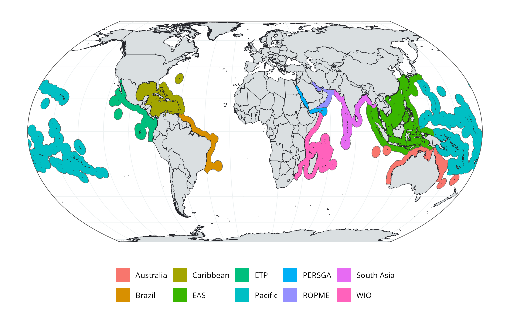

# gcrmn_regions 

## 1. Introduction

The goal of this repository is to provide the R code used to create the 10 GCRMN (*Global Coral Reef Monitoring Network*) regions and the 53 GCRMN subregions from MEOW dataset. The GCRMN regions are the following:

* Australia
* Brazil
* Caribbean
* EAS = East Asian Seas
* ETP = Eastern Tropical Pacific
* Pacific
* PERSGA = Regional Organization for the Conservation of the Environment of the Red Sea and Gulf of Aden
* ROPME = Regional Organization for the Protection of the Marine Environment
* South Asia
* WIO = Western Indian Ocean

**Figure 1.** Map of the ten GCRMN regions.

## 2. How the regions were created?

The raw data used to create the GCRMN regions, subregions, and ecoregions, were derived from the *Marine Ecoregions of the World* ([Spalding *et al.*, 2007](https://doi.org/10.1641/B570707)) and the World Exclusive Economic Zones ([Flanders Marine Institute, 2023](https://www.marineregions.org/downloads.php)).

The ecoregions were aggregated to create the 10 GCRMN regions, the 53 GCRMN subregions, and the 111 GCRMN ecoregions. The resulting data are located in `data\gcrmn-regions`, either in RData (*gcrmn_regions.RData*, *gcrmn_subregions.RData*, and *gcrmn_ecoregions.RData*) or in shapefile format (*gcrmn_regions.shp*, *gcrmn_subregions.shp*, and *gcrmn_ecoregions.shp*).

## 3. How to cite this dataset?

When using this dataset, please use the following citation: 

> GCRMN (2025). Global Coral Reef Monitoring Network (GCRMN) boundaries of regions, subregions, and ecoregions. Downloaded from https://github.com/GCRMN/gcrmn_regions. Accessed on YEAR-MONTH-DAY.

## 4. References

Flanders Marine Institute (2023). Maritime Boundaries Geodatabase: Maritime Boundaries and Exclusive Economic Zones (200NM), version 12. Retrieved from https://www.marineregions.org/downloads.php. Accessed on 2024-06-16.

Spalding, M. D., Fox, H. E., Allen, G. R., Davidson, N., Ferdaña, Z. A., Finlayson, M. A. X., [...] & Robertson, J. (**2007**). [Marine ecoregions of the world: a bioregionalization of coastal and shelf areas](https://doi.org/10.1641/B570707). *BioScience*, 57(7), 573-583.
